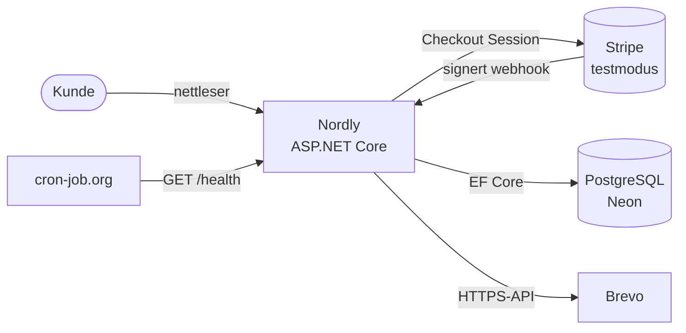
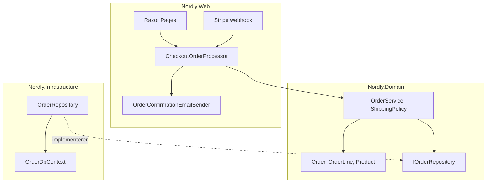
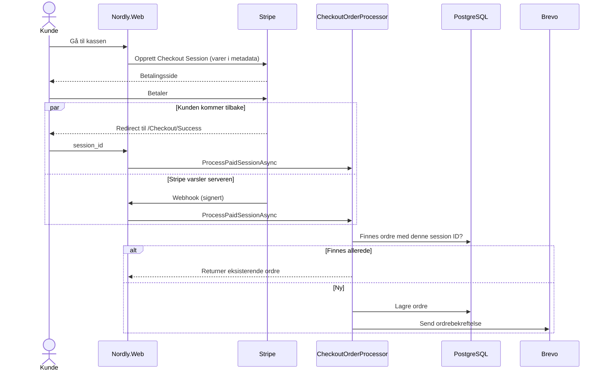
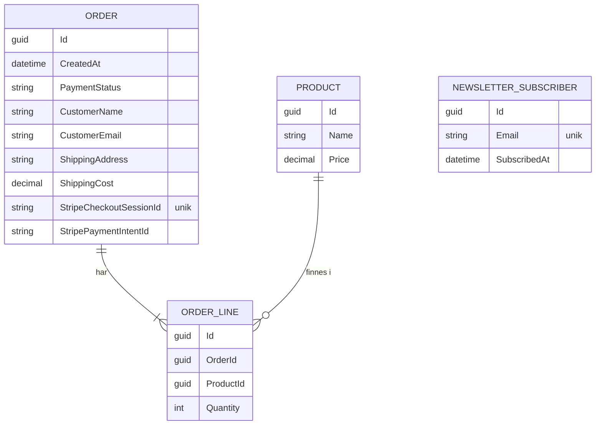

# Nordly – Arkitektur

Dette dokumentet beskriver hvordan Nordly er bygget, og hvorfor. Det er ment for utviklere som vil forstå systemet før de leser koden.

## 1. Kontekst og mål

Nordly er en nettbutikk der kunden legger varer i handlekurven, betaler med Stripe og får en ordrebekreftelse på e-post.

**Mål**
- Én betaling skal alltid gi nøyaktig én ordre, også om kunden lukker nettleseren etter betaling.
- Forretningsreglene (ordre, frakt) skal kunne testes uten database eller nettverk.
- Systemet skal kunne driftes gratis.

**Utenfor omfang**
- Ekte betaling. Stripe kjører i testmodus.
- Admin-panel, lagerstyring og brukerkontoer.

## 2. Krav

| Type | Krav |
|---|---|
| Funksjonelt | Kunden kan legge varer i handlekurven og betale |
| Funksjonelt | Betalt ordre lagres med kunde, adresse, varer og frakt |
| Funksjonelt | Kunden får ordrebekreftelse på e-post |
| Funksjonelt | Fri frakt fra 800 kr, ellers 79 kr |
| Ikke-funksjonelt | Idempotent ordreopprettelse (én betaling = én ordre) |
| Ikke-funksjonelt | Ingen hemmeligheter i koden, kun miljøvariabler |
| Ikke-funksjonelt | Webhooks fra Stripe må være signert og verifisert |
| Ikke-funksjonelt | `/health` viser om appen når databasen |

## 3. Systemkontekst

## 4. Komponenter og lag

| Lag | Ansvar | Avhenger av |
|---|---|---|
| **Domain** | Entiteter, forretningsregler og grensesnitt | Ingenting |
| **Infrastructure** | Databasetilgang med EF Core og PostgreSQL | Domain |
| **Web** | Sider, webhook, Stripe, e-post og oppsett | Domain og Infrastructure |

Domain kjenner ikke til database, Stripe eller ASP.NET. Derfor kan reglene testes isolert. For eksempel validerer `Order` at antall er større enn null, og `ShippingPolicy` regner ut frakt.

## 5. Betalingsflyt

Kunden kan komme tilbake til Success-siden, og Stripe sender i tillegg en webhook. Begge veiene kan komme i hvilken som helst rekkefølge, eller samtidig. Derfor går begge gjennom samme `CheckoutOrderProcessor`.

**Slik sikres nøyaktig én ordre**
1. Processor ignorerer sesjoner som ikke har status `paid`.
2. Den slår opp ordren på `StripeCheckoutSessionId` først.
3. Databasen har en unik indeks på `StripeCheckoutSessionId`. Om to forespørsler lagrer samtidig, feiler den ene.
4. Den som feiler fanger `DbUpdateException` og henter ordren den andre lagret. Finnes det ingen ordre, er det en ekte databasefeil. Da kastes feilen videre, webhooken svarer 500, og Stripe prøver på nytt.
5. E-post sendes bare av den som faktisk opprettet ordren.

Webhooken håndterer `checkout.session.completed` og `checkout.session.async_payment_succeeded`.

## 6. Datamodell

## 7. Designbeslutninger

**ADR-1: Lagdelt arkitektur (Web, Domain, Infrastructure)**
- *Valg:* Tre prosjekter der Domain ikke avhenger av noe.
- *Alternativ:* Alt i ett prosjekt.
- *Hvorfor:* Forretningsreglene kan testes uten database, og databasen kan byttes uten å røre reglene.

**ADR-2: Webhook i tillegg til Success-siden**
- *Valg:* Ordren opprettes fra begge steder.
- *Alternativ:* Bare Success-siden.
- *Hvorfor:* Lukker kunden nettleseren etter betaling, kommer de aldri til Success-siden. Webhooken sørger for at ordren likevel blir lagret.

**ADR-3: Idempotens med Stripe session ID og unik indeks**
- *Valg:* Session ID er nøkkelen, og databasen håndhever at den er unik.
- *Alternativ:* Bare sjekke i koden før lagring.
- *Hvorfor:* En sjekk i koden alene stopper ikke to samtidige forespørsler. Den unike indeksen gjør det.

**ADR-4: Neon i stedet for Render Postgres**
- *Valg:* Gratis PostgreSQL hos Neon.
- *Alternativ:* Render sin gratis database.
- *Hvorfor:* Render sin gratis database slettes etter en periode. Neon er permanent og skalerer til null når den ikke brukes.

**ADR-5: cron-job.org mot kaldstart**
- *Valg:* Kall `/health` hvert 10. minutt på hverdager kl. 07–20.
- *Alternativ:* Betalt plan hos Render.
- *Hvorfor:* Render sin gratisplan sover etter 15 minutter. Pingen holder appen våken når den mest sannsynlig besøkes, og holder seg innenfor 750 gratis timer i måneden.

**ADR-6: E-post via Brevo sitt HTTP-API**
- *Valg:* Ordrebekreftelser sendes med Brevo sitt API over HTTPS. SMTP-senderen brukes bare når ingen API-nøkkel er satt, for eksempel lokalt.
- *Alternativ:* SMTP direkte fra appen.
- *Hvorfor:* Render sin gratisplan blokkerer utgående SMTP-porter (25, 465, 587). Begge senderne implementerer samme grensesnitt, så resten av koden merker ikke forskjell.

**ADR-7: Nøkler for databeskyttelse i Postgres**
- *Valg:* ASP.NET Core sine nøkler for å kryptere cookies og skjema-tokens lagres i tabellen `DataProtectionKeys` i Postgres.
- *Alternativ:* Standard lagring på disk i containeren.
- *Hvorfor:* Containeren hos Render mister disken ved hver omstart og deploy. Da ble nøklene nye, og skjemaer som var åpne i nettleseren feilet med 400. Med nøklene i databasen overlever de omstart.

## 8. Begrensninger og videre arbeid

- **Kaldstart:** Utenom hverdager 07–20 kan første besøk ta opptil ett minutt.
- **Databaseskjema:** `EnsureCreated` brukes i stedet for EF-migrasjoner. Endringer i modellen krever derfor manuell håndtering. Neste steg er å gå over til migrasjoner.
- **Ingen admin:** Ordrer kan bare ses direkte i databasen.
- **Ingen kø for e-post:** Feiler utsendingen, logges det, men e-posten sendes ikke på nytt.
- **Handlekurv i minnet:** Sesjonen ligger i minnet, så handlekurven tømmes når appen starter på nytt. Neste steg er å lagre sesjonen i Postgres.
